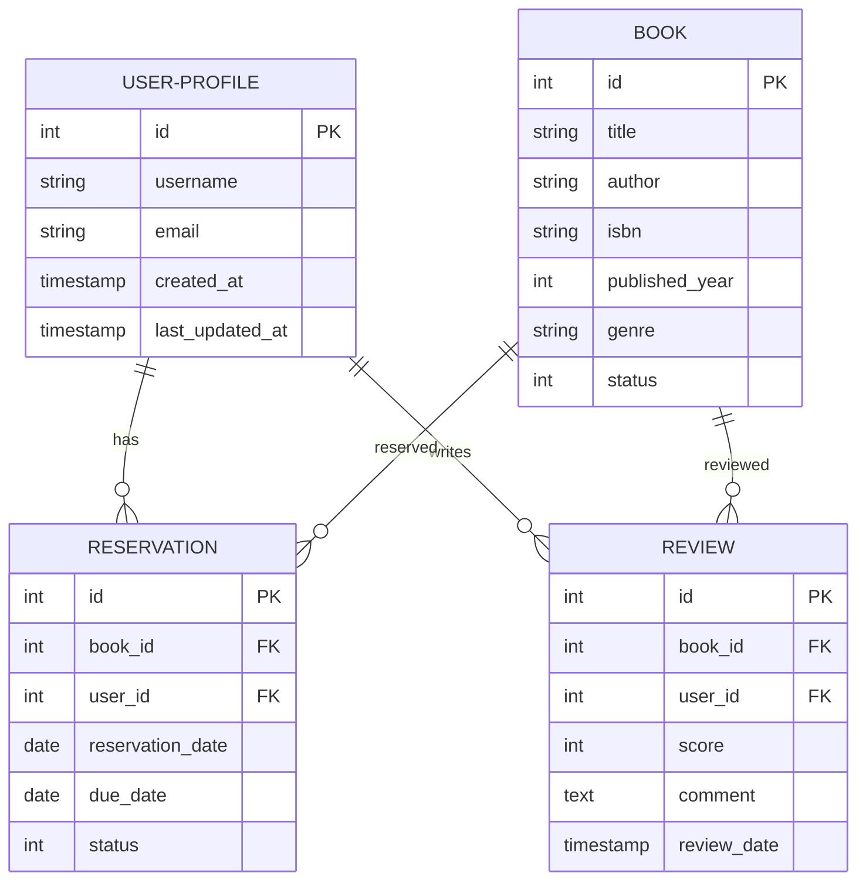
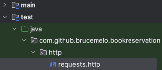

# Book Reservation - Java 21 - Micronaut

## Requirements

- Java 21

## Tech stack

- Java 21
- Micronaut
- Jooq
- H2
- Liquibase

## Running the application

```shell script
./gradlew run
```

or open in Intellij and run

## ER Diagram



## Test
> **_NOTE:_**  Look at file requests.http
> 
> 

```
###
GET http://localhost:8080/api/books/search

###
GET http://localhost:8080/api/books/search?title=Hobbit

###
GET http://localhost:8080/api/users

###
GET http://localhost:8080/api/reviews

###
POST http://localhost:8080/api/reservations
Content-Type: application/json

{
  "bookId": 1,
  "userId": 1,
  "reservationDate":"2024-12-01"
}

###
POST http://localhost:8080/api/reviews
Content-Type: application/json

{
  "bookId": 1,
  "userId": 1,
  "score": 4,
  "comment":"Nice!"
}


```